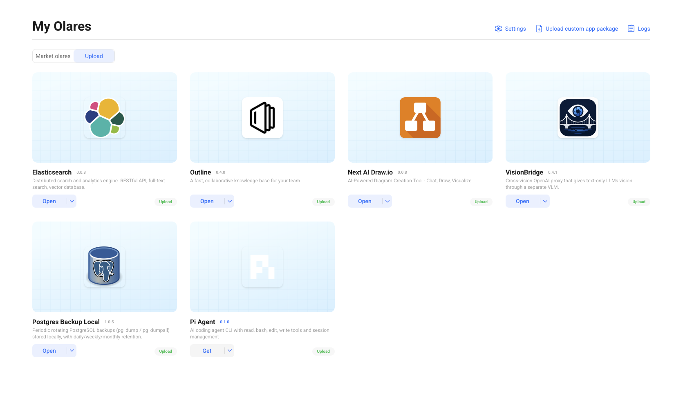

# Personal Olares App Catalog

A personal collection of Olares application charts (OAC) I've developed and
ported. Each app is a top-level folder containing the unpacked Helm chart
(`Chart.yaml`, `OlaresManifest.yaml`, `values.yaml`, `templates/`, …), laid out
the same way as the official [`beclab/apps`](https://github.com/beclab/apps)
repository.

The repo keeps the **unpacked source charts**; every packaged chart (`.tgz`) is
published as a **GitHub Release** (one per app/version). Icons are versioned in
[`assets/icons/`](assets/icons) and served via jsDelivr from this repo.



## Installing an app

Each release ships the ready-to-install packaged chart (`.tgz`). To install one
on your own Olares:

```bash
# 1. pull a package
wget https://github.com/technigmaai/olares-apps/releases/download/<app>-<ver>/<app>-<ver>.tgz

# 2. land it in your Olares' Local Sources (upload bucket)
olares-cli market upload ./<app>-<ver>.tgz

# 3. install it (add -s upload for locally-uploaded charts)
olares-cli market install <app> -s upload --version <ver> --watch
```

> Most apps expose editable settings via the Olares app → **Variables** page
> (e.g. API keys, endpoints, schedules). The chart reads those at install and
> applies changes with `applyOnChange`.

## Applications

| App | Title | Chart ver | App ver | Category | What it is |
|---|---|---|---|---|---|
| [deepseekharness](./deepseekharness) | DeepSeek Harness | 0.1.3 | 0.1.2-alpha.4 | Developer Tools | Agentic coding environment with Caddy web login (DSH + workstation toolchain) |
| [elasticsearch](./elasticsearch) | Elasticsearch | 0.0.8 | 9.4.4 | Utilities | Distributed search & analytics engine (REST API, full-text search) |
| [nextaidrawio](./nextaidrawio) | Next AI Draw.io | 0.0.8 | 0.4.16 | Utilities | AI-powered diagramming — chat, draw, visualize |
| [outlineapp](./outlineapp) | Outline | 0.4.0 | 1.9.2 | Productivity | Fast, collaborative knowledge base / wiki for your team |
| [piagent](./piagent) | Pi Agent | 0.1.0 | 0.80.6 | Developer Tools | AI coding-agent CLI (read / bash / edit / write tools) |
| [postgresbackup](./postgresbackup) | Postgres Backup Local | 1.0.5 | 17 | Utilities | Periodic rotating PostgreSQL backups (`pg_dump`) |
| [visionbridge](./visionbridge) | VisionBridge | 0.4.1 | 0.2.0 | AI | Cross-vision OpenAI proxy: text-only LLMs get vision via a VLM |

## App notes

- **DeepSeek Harness** — agentic coding environment (DSH) behind a Caddy
  login + rate-limit layer. Uses the `moelin/deepseek-harness` workstation
  image via a thin Olares fork (`docker.io/technigmaai/deepseek-harness`)
  that runs as uid 1000. Set the login password in the app's Variables
  (`AUTH_PASSWORD`); `AUTH_MODE=none` switches to Olares-SSO-only login.
  State in `Data/deepseekharness`, workspaces under `Data/deepseekharness/workspaces`.
- **Elasticsearch** — the official Elasticsearch engine (single node) packaged
  as an Olares app. Security, SSL, license type, Java opts and disk watermarks
  are configurable in the app's Variables.
- **Next AI Draw.io** — AI-assisted diagram creation built around draw.io.
  Configure the AI provider/model and API keys in the app's Variables.
- **Outline** — a fast collaboration wiki/knowledge base with rich OIDC, Google
  and Slack sign-in options, plus SMTP, file-storage and rate-limiter settings.
- **Pi Agent** — the Pi coding-agent CLI. Run it from the app terminal. A
  `Dockerfile` is included for **building your own image**; alternatively use
  the prebuilt image referenced in the deployment manifest
  (`docker.io/technigmaai/pi-agent:0.80.6`).
  **Set-up:** first run `pi` in the app terminal to create its data folder,
  then add your LLM to `models.json` and pick the default in `settings.json`
  under `Data/piagent/.pi/agent/` — see [piagent/README.md](piagent/README.md).
- **Postgres Backup Local** — rotating `pg_dump` backups of one or more
  PostgreSQL databases. Targets, schedule (`cron`), retention and optional
  webhook notifications are all configurable.
- **VisionBridge** — an OpenAI-compatible proxy that gives a text-only reasoning
  model vision by delegating image understanding to a separate vision (VLM)
  model. Every parameter (reasoning/vision endpoints + API keys, models, limits,
  `BRIDGE_API_KEYS` auth, advanced `EXTRA_MODELS`) is editable in the app's
  Variables.

## Sources & acknowledgements

These charts are community ports / wrappers of existing open-source projects.
Each app's licensing is governed by its **upstream** project:

| App | Source repository | Upstream license |
|---|---|---|
| elasticsearch | [elastic/elasticsearch](https://github.com/elastic/elasticsearch) | Elastic License 2.0 (or SSPL / AGPL-3.0) — source-available, **not** Apache |
| nextaidrawio | [DayuanJiang/next-ai-draw-io](https://github.com/DayuanJiang/next-ai-draw-io) | Apache-2.0 |
| outlineapp | [outline/outline](https://github.com/outline/outline) | Business Source License 1.1 |
| piagent | [earendil-works/pi](https://github.com/earendil-works/pi) | MIT |
| postgresbackup | [prodrigestivill/docker-postgres-backup-local](https://github.com/prodrigestivill/docker-postgres-backup-local) | MIT |
| visionbridge | [thomasunise/visionbridge](https://github.com/thomasunise/visionbridge) | MIT |

## Releases

Each packaged chart is attached to a GitHub Release per app/version:

| Release              | Asset                    |
|----------------------|--------------------------|
| deepseekharness-0.1.3 | deepseekharness-0.1.3.tgz |
| elasticsearch-0.0.8  | elasticsearch-0.0.8.tgz  |
| nextaidrawio-0.0.8   | nextaidrawio-0.0.8.tgz   |
| outlineapp-0.4.0     | outlineapp-0.4.0.tgz     |
| piagent-0.1.0        | piagent-0.1.0.tgz        |
| postgresbackup-1.0.5 | postgresbackup-1.0.5.tgz |
| visionbridge-0.4.1   | visionbridge-0.4.1.tgz   |

## Layout

```
.
├── <app>/               # unpacked Olares application chart per app
│   ├── Chart.yaml
│   ├── OlaresManifest.yaml
│   ├── values.yaml
│   └── templates/
├── assets/icons/        # app icons (served via jsDelivr from this repo)
├── .gitignore           # ignores packaged *.tgz (they live on Releases)
└── README.md
```

## Licenses

This catalog is a collection of **community ports**: the Kubernetes/Olares
packaging here (charts, manifests, Dockerfiles, icons, this repo) is **our own
work** and is licensed under the
[Apache License 2.0](LICENSE).
Copyright 2026 Technigma AI.

Each app's **underlying software** belongs to its respective upstream project
and remains governed by that project's license (linked in the table above) —
our license does **not** change the upstream terms. Nothing here is affiliated
with or endorsed by the upstream projects. Before redistributing or reusing an
app, review the applicable upstream license — in particular note
Elasticsearch's source-available terms and Outline's Business Source License.
